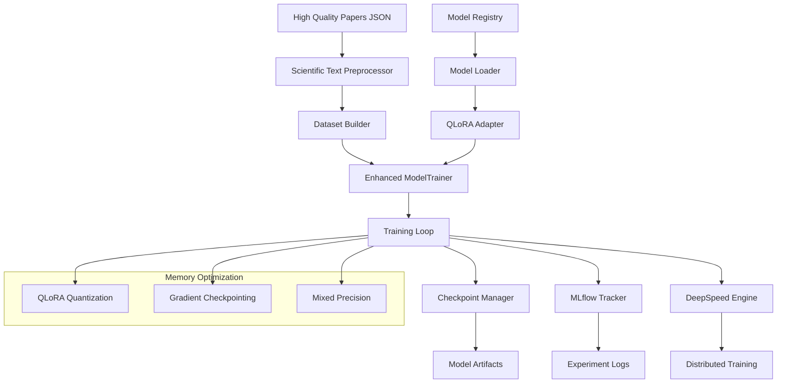

# Design Document

## Overview

The LLM fine-tuning pipeline enhancement extends the existing ScientificLLM-Forge trainer to support advanced parameter-efficient fine-tuning of large language models. The design focuses on memory-efficient training using QLoRA techniques, enabling researchers to fine-tune 7B parameter models on genomics papers within <16GB GPU memory constraints. The system integrates with existing infrastructure while adding support for distributed training, MLflow experiment tracking, and advanced checkpoint management.

## Architecture

### High-Level Architecture



### Component Integration

The enhanced trainer integrates with existing ScientificLLM-Forge components:

- **Data Pipeline**: Extends existing data processing to handle scientific papers
- **Configuration System**: Enhances configs/training.yaml with LLM-specific parameters
- **Logging Infrastructure**: Integrates with existing logging while adding MLflow support
- **Model Management**: Builds upon existing model handling with parameter-efficient methods

## Components and Interfaces

### 1. Enhanced ModelTrainer Class

```python
class EnhancedModelTrainer(ModelTrainer):
    """Enhanced trainer supporting LLM fine-tuning with QLoRA."""
    
    def __init__(self, config: TrainingConfig, data_module: ScientificDataModule):
        # Initialize with QLoRA and distributed training support
        
    def setup_model(self) -> None:
        # Load pre-trained model with QLoRA adapters
        
    def setup_training(self) -> None:
        # Configure training with memory optimization
        
    def train_with_qlora(self) -> None:
        # Main training loop with parameter-efficient fine-tuning
```

### 2. Scientific Data Module

```python
class ScientificDataModule:
    """Data module for processing scientific papers."""
    
    def load_high_quality_papers(self, file_path: str) -> List[Dict]:
        # Load papers from high_quality_papers.json format
        
    def preprocess_scientific_text(self, papers: List[Dict]) -> Dataset:
        # Apply genomics-specific preprocessing
        
    def create_training_datasets(self) -> Tuple[Dataset, Dataset]:
        # Create train/validation splits with proper formatting
```

### 3. QLoRA Configuration Manager

```python
class QLoRAConfig:
    """Configuration for QLoRA parameter-efficient fine-tuning."""
    
    r: int = 16  # LoRA rank
    lora_alpha: int = 32  # LoRA scaling parameter
    lora_dropout: float = 0.1  # LoRA dropout
    target_modules: List[str]  # Target modules for LoRA
    quantization_config: BitsAndBytesConfig  # 4-bit quantization
```

### 4. MLflow Integration

```python
class MLflowTracker:
    """MLflow experiment tracking integration."""
    
    def setup_experiment(self, experiment_name: str) -> None:
        # Initialize MLflow experiment
        
    def log_hyperparameters(self, config: Dict) -> None:
        # Log training configuration
        
    def log_metrics(self, metrics: Dict, step: int) -> None:
        # Log training/validation metrics
        
    def log_model_artifacts(self, model_path: str) -> None:
        # Log model checkpoints and artifacts
```

### 5. Distributed Training Manager

```python
class DistributedTrainingManager:
    """DeepSpeed integration for distributed training."""
    
    def setup_deepspeed(self, config: Dict) -> None:
        # Initialize DeepSpeed configuration
        
    def configure_zero_optimization(self) -> None:
        # Setup ZeRO optimizer state partitioning
        
    def handle_gradient_synchronization(self) -> None:
        # Manage gradient synchronization across GPUs
```

## Data Models

### Training Configuration Extension

```yaml
# Extended training.yaml for LLM fine-tuning
training:
  model:
    name: "meta-llama/Llama-2-7b-hf"  # Support for LLaMA-2
    model_type: "llama"  # Model architecture type
    max_length: 2048  # Extended context length
    
  # QLoRA configuration
  qlora:
    enabled: true
    r: 16
    lora_alpha: 32
    lora_dropout: 0.1
    target_modules: ["q_proj", "v_proj", "k_proj", "o_proj"]
    quantization:
      load_in_4bit: true
      bnb_4bit_compute_dtype: "float16"
      bnb_4bit_use_double_quant: true
      bnb_4bit_quant_type: "nf4"
      
  # Scientific data processing
  scientific_data:
    data_file: "data/high_quality_papers_demo.json"
    text_fields: ["title", "abstract", "full_text"]
    preprocessing:
      remove_citations: true
      normalize_scientific_notation: true
      handle_special_tokens: true
      
  # MLflow tracking
  mlflow:
    enabled: true
    experiment_name: "genomics-llm-finetuning"
    tracking_uri: "file:./mlruns"
    
  # Distributed training
  distributed:
    enabled: false  # Enable for multi-GPU
    backend: "deepspeed"
    deepspeed_config: "configs/deepspeed_config.json"
```

### Scientific Paper Data Model

```python
@dataclass
class ScientificPaper:
    """Data model for scientific papers."""
    pmid: str
    title: str
    authors: List[str]
    journal: str
    publication_date: str
    doi: str
    score: float
    tier: str
    keywords_found: List[str]
    benchmarks_used: List[str]
    validation_methods: List[str]
    
    def to_training_text(self) -> str:
        """Convert paper to training text format."""
        # Format paper content for training
```

## Error Handling

### Memory Management

- **Out of Memory Errors**: Implement gradient checkpointing and dynamic batch sizing
- **Model Loading Failures**: Fallback to smaller models or different quantization levels
- **CUDA Errors**: Automatic device detection and fallback to CPU training

### Training Stability

- **Gradient Explosion**: Implement gradient clipping and learning rate scheduling
- **Loss Divergence**: Early stopping and checkpoint restoration
- **Distributed Training Failures**: Automatic recovery and re-synchronization

### Data Processing Errors

- **Malformed Papers**: Skip invalid entries with logging
- **Encoding Issues**: Robust text preprocessing with fallback encodings
- **Missing Fields**: Default value handling and validation

## Testing Strategy

### Unit Tests

1. **QLoRA Configuration Tests**
   - Validate LoRA parameter settings
   - Test quantization configuration
   - Verify memory usage calculations

2. **Data Processing Tests**
   - Test scientific text preprocessing
   - Validate dataset creation
   - Check data format compatibility

3. **Model Loading Tests**
   - Test LLaMA-2 model loading
   - Verify QLoRA adapter attachment
   - Check memory optimization

### Integration Tests

1. **End-to-End Training Tests**
   - Small-scale training runs
   - Checkpoint save/restore functionality
   - MLflow logging integration

2. **Distributed Training Tests**
   - Multi-GPU training simulation
   - DeepSpeed integration testing
   - Gradient synchronization validation

3. **Memory Efficiency Tests**
   - GPU memory usage monitoring
   - Performance benchmarking
   - Scalability testing

### Performance Tests

1. **Memory Usage Validation**
   - Confirm <16GB GPU memory usage
   - Monitor memory peaks during training
   - Test with different batch sizes

2. **Training Speed Benchmarks**
   - Compare QLoRA vs full fine-tuning
   - Measure distributed training speedup
   - Evaluate preprocessing performance

3. **Model Quality Assessment**
   - Perplexity evaluation on genomics text
   - Domain-specific task performance
   - Comparison with baseline models